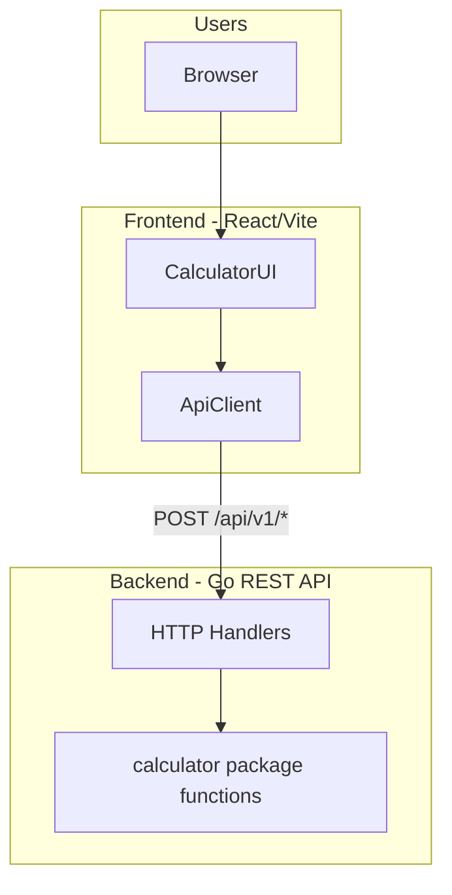
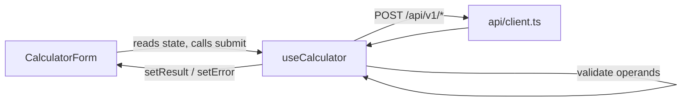
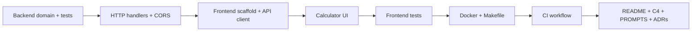

# Sezzle Full-Stack Calculator — Implementation Plan

> Snapshot of planning decisions from the grill sessions. See git history for evolution.

## Decisions locked in (grill session)

| Decision | Choice |
|----------|--------|
| API shape | Per-operation `POST` endpoints under `/api/v1/` |
| Optional ops | All: exponentiation, square root, percentage |
| Percentage rule | `a% of b` → `(a / 100) * b` |
| Docker | `docker-compose` for frontend + backend |
| Coverage | GitHub Actions CI **and** local `Makefile` targets |
| Frontend CSS | CSS Modules (one `.module.css` per component) |
| Visual theme | Clean card form — centered card, light gray page, neutral palette |
| Design tokens & a11y | CSS custom properties + `:focus-visible` + `aria-label` / `role="alert"` |
| State location | Custom `useCalculator` hook — form is presentational |
| Async handling | `async submit()` with try/catch; `isLoading` / `result` / `error` state |
| Operand shape | Strings in state; validate at submit; clear result/error on operation change |
| API errors | `ApiError` class with `status`, `code`, `message`; client throws on non-2xx |
| Error display | Show backend `error` message directly in UI |
| Client structure | One typed function per operation in `api/client.ts` |
| Go router | stdlib `net/http` + `ServeMux` (Go 1.22+ method patterns) — zero deps |
| Go handlers | Single `Handler` struct, one `handler.go` with shared JSON helpers |
| Go domain | Pure package functions — `calculator.Add(a, b)` |
| Go errors | Typed sentinel errors in calculator; handler maps to HTTP status + code |
| Docker frontend | nginx multi-stage — static SPA + `/api/` reverse proxy |
| Docker ports | App on **:8080**, direct API on **:5000** (host) |
| Docker backend image | Multi-stage build → `alpine` runtime |
| CI coverage | **Report only** — upload artifacts; no fail on % |
| CI structure | **Parallel jobs** — `backend-test` + `frontend-test` |
| CI triggers | `push` + `pull_request` to `main` |
| Request logging | **`log/slog` middleware** — Info for 2xx, Warn for 4xx/5xx |

---

## Target architecture



### C4 documentation (to create under [`docs/c4/`](docs/c4/))

- **Level 1 — Context**: User interacts with Calculator Web App; app calls Calculator API.
- **Level 2 — Container**: React SPA via nginx (host **:8080**) ↔ Go REST service (host **:5000** for direct API; internal `:8080` on Docker network).
- **Level 3 — Component (backend)**: `handlers/` → `calculator/` (pure domain) → `middleware/` (logging, CORS).
- **Level 3 — Component (frontend)**: `CalculatorForm` → `useCalculator` hook → `api/client.ts`.

Diagrams will be Mermaid in markdown files (no external tooling required).

---

## Repository layout

```
sezzle-fullstack-calculator/
├── backend/
│   ├── cmd/server/main.go
│   ├── internal/
│   │   ├── calculator/       # pure functions + sentinel errors
│   │   ├── handler/          # Handler struct, handler.go
│   │   └── middleware/       # CORS, request logging
│   ├── Dockerfile            # multi-stage → alpine
│   ├── go.mod
│   └── *_test.go
├── frontend/
│   ├── src/ ...
│   ├── Dockerfile            # multi-stage → nginx
│   ├── nginx.conf            # SPA + /api/ proxy to backend:8080
│   ├── package.json
│   └── vitest.config.ts
├── docs/
│   ├── PLAN.md                 # implementation plan (decisions, architecture, build order)
│   ├── c4/                     # C4 diagrams (mermaid)
│   └── adr/
│       ├── 0001-per-operation-api.md
│       └── 0002-percentage-semantics.md
├── .github/workflows/ci.yml
├── docker-compose.yml
├── Makefile                    # dev, test, coverage shortcuts
├── AGENTS.md                   # AI agent orientation (root — pointers + constraints)
├── CONTEXT.md                  # glossary only (Operation, Operand, Calculation)
├── PROMPTS.md                  # AI prompts used during build
├── README.md                   # setup, API examples, design rationale
└── .gitignore                  # Go + Node entries

backend/AGENTS.md               # Go-specific agent guidance (nested)
frontend/AGENTS.md              # React-specific agent guidance (nested)
```

---

## Backend (Go)

### API endpoints

All endpoints accept JSON, return JSON, and use consistent shapes.

| Method | Path | Body | Success response |
|--------|------|------|------------------|
| GET | `/health` | — | `{ "status": "ok" }` |
| POST | `/api/v1/add` | `{ "a": 2, "b": 3 }` | `{ "result": 5 }` |
| POST | `/api/v1/subtract` | `{ "a": 5, "b": 3 }` | `{ "result": 2 }` |
| POST | `/api/v1/multiply` | `{ "a": 4, "b": 3 }` | `{ "result": 12 }` |
| POST | `/api/v1/divide` | `{ "a": 10, "b": 2 }` | `{ "result": 5 }` |
| POST | `/api/v1/power` | `{ "a": 2, "b": 8 }` | `{ "result": 256 }` |
| POST | `/api/v1/sqrt` | `{ "a": 16 }` | `{ "result": 4 }` |
| POST | `/api/v1/percentage` | `{ "a": 20, "b": 150 }` | `{ "result": 30 }` |

**Error response** (all endpoints):

```json
{ "error": "division by zero", "code": "DIVISION_BY_ZERO" }
```

HTTP status codes:
- `400` — missing/invalid fields, non-numeric values, sqrt of negative
- `422` — domain errors (division by zero)
- `500` — unexpected server error

### Go decisions (grill session)

| Layer | Choice |
|-------|--------|
| Router | **stdlib `net/http.ServeMux`** — `HandleFunc("POST /api/v1/add", h.Add)` |
| Handlers | **Single `Handler` struct** in `handler/handler.go` — 7 methods + shared `writeJSON` / `writeError` |
| Domain | **Pure functions** — `calculator.Add(a, b float64) (float64, error)` |
| Errors | **Sentinel errors** in calculator; handler maps via `errors.Is` → HTTP status + code |

**Planned backend layout:**

```
backend/internal/
├── calculator/
│   ├── calculator.go      # Add, Subtract, … Percentage
│   ├── calculator_test.go
│   └── errors.go          # ErrDivisionByZero, ErrInvalidOperand, …
├── handler/
│   ├── handler.go         # type Handler struct{}; methods Add, Subtract, …
│   ├── handler_test.go    # httptest for key routes
│   └── response.go        # writeJSON, writeError, errorCode mapping
└── middleware/
    └── cors.go
```

**Error mapping (handler owns HTTP):**

| Domain error | HTTP | Code |
|--------------|------|------|
| `ErrDivisionByZero` | 422 | `DIVISION_BY_ZERO` |
| `ErrInvalidOperand` (sqrt negative) | 400 | `INVALID_OPERAND` |
| JSON decode / missing fields | 400 | `INVALID_REQUEST` |

**Route wiring in `main.go`:**

```go
h := &handler.Handler{}
mux := http.NewServeMux()
mux.HandleFunc("GET /health", h.Health)
mux.HandleFunc("POST /api/v1/add", h.Add)
// … remaining operations
http.ListenAndServe(":8080", middleware.Logging(middleware.CORS(mux)))
```

CORS middleware enabled for **local dev** (Vite on `:5173` → backend on `:8080`). In Docker, browser hits nginx same-origin so CORS is not needed for normal UI flow.

**Request logging** (`middleware/logging.go`):

```go
// Wraps ResponseWriter to capture status code
// 2xx → slog.Info("request", method, path, status, duration_ms)
// 4xx/5xx → slog.Warn("request", method, path, status, duration_ms)
```

- stdlib `log/slog` only — JSON handler in production, text handler acceptable for dev
- No metrics/Prometheus (out of scope)

### Layering (~1h)

1. **[`backend/internal/calculator/`](backend/internal/calculator/)** — pure functions + sentinel errors; table-driven tests.
2. **[`backend/internal/handler/handler.go`](backend/internal/handler/handler.go)** — single `Handler` struct, decode JSON → call calculator → respond.
3. **[`backend/cmd/server/main.go`](backend/cmd/server/main.go)** — stdlib ServeMux, no third-party router.

### Key edge cases to test

- Division by zero → `422` + `DIVISION_BY_ZERO`
- Sqrt of negative number → `400` + `INVALID_OPERAND`
- Missing `a`/`b` → `400` + `INVALID_REQUEST`
- Percentage: `20% of 150` = `30` (documented in README + ADR)

---

## Frontend (React + TypeScript + Vite)

### Styling decisions (grill session)

| Layer | Choice |
|-------|--------|
| Tooling | **CSS Modules** — e.g. `CalculatorForm.module.css`, `App.module.css` |
| Layout | **Clean card form** — full-viewport light gray (`--color-bg`), centered white card with subtle shadow |
| Tokens | CSS custom properties on `:root` in [`frontend/src/styles/tokens.css`](frontend/src/styles/tokens.css) |
| Responsive | Mobile-first: card fills width below `480px`, max-width `420px` centered above |
| a11y | `:focus-visible` ring on inputs/buttons; `aria-label` on inputs; `role="alert"` on error text |

**Token palette (neutral, professional):**

```css
:root {
  --color-bg: #f4f4f5;
  --color-surface: #ffffff;
  --color-text: #18181b;
  --color-muted: #71717a;
  --color-primary: #2563eb;
  --color-error: #dc2626;
  --color-success: #16a34a;
  --radius: 8px;
  --shadow: 0 1px 3px rgb(0 0 0 / 0.1);
  --spacing-sm: 0.5rem;
  --spacing-md: 1rem;
  --spacing-lg: 1.5rem;
}
```

**File structure:**

```
frontend/src/
├── styles/
│   ├── tokens.css          # CSS custom properties (imported in main.tsx)
│   └── global.css          # reset + box-sizing only
├── components/
│   ├── CalculatorForm.tsx
│   ├── CalculatorForm.module.css
│   └── ResultDisplay.tsx   # optional split if form grows
└── App.module.css          # page layout (centered card wrapper)
```

No UI library, no Tailwind, no dark mode (out of brief scope).

### State management decisions (grill session)

| Layer | Choice |
|-------|--------|
| State location | **`useCalculator` hook** — owns all form state and submit logic |
| Async pattern | **`async submit()`** with try/catch; no TanStack Query |
| Operand type | **`string`** — natural fit for controlled inputs; parse at submit |
| On operation change | Clear **`result`** and **`error`** only; keep operand values |

**Hook interface (planned):**

```ts
// hooks/useCalculator.ts
type UseCalculatorReturn = {
  operation: Operation;
  setOperation: (op: Operation) => void;
  operandA: string;
  setOperandA: (v: string) => void;
  operandB: string;
  setOperandB: (v: string) => void;
  result: number | null;
  error: string | null;
  isLoading: boolean;
  submit: () => Promise<void>;
  isUnary: boolean; // true for sqrt — form hides operand B
};
```

**Responsibility split:**



- **`CalculatorForm`** — controlled inputs, operation dropdown, submit button, result/error display; no fetch calls
- **`useCalculator`** — state, client-side validation, API call, loading/error/result updates
- **`api/client.ts`** — typed fetch wrapper; throws `ApiError` on non-2xx responses

**Updated file structure:**

```
frontend/src/
├── hooks/
│   ├── useCalculator.ts
│   └── useCalculator.test.ts
├── api/
│   ├── client.ts
│   ├── client.test.ts
│   └── errors.ts
├── styles/
│   ├── tokens.css
│   └── global.css
├── components/
│   ├── CalculatorForm.tsx
│   ├── CalculatorForm.module.css
│   └── ResultDisplay.tsx   # optional split if form grows
└── App.module.css
```

### API client decisions (grill session)

| Layer | Choice |
|-------|--------|
| Error type | **`ApiError`** class — `status`, `code`, `message` |
| User display | **`ApiError.message`** shown directly — backend owns wording |
| Exports | **One function per operation** — `add()`, `subtract()`, … `percentage()` |
| Network failures | Wrap unknown errors as `ApiError(0, 'NETWORK_ERROR', 'Unable to reach server')` |

**Planned types and client surface:**

```ts
// api/errors.ts
export class ApiError extends Error {
  constructor(
    readonly status: number,
    readonly code: string,
    message: string,
  ) {
    super(message);
    this.name = 'ApiError';
  }
}

// api/client.ts — each returns result number, throws ApiError
export async function add(a: number, b: number): Promise<number>
export async function subtract(a: number, b: number): Promise<number>
export async function multiply(a: number, b: number): Promise<number>
export async function divide(a: number, b: number): Promise<number>
export async function power(a: number, b: number): Promise<number>
export async function sqrt(a: number): Promise<number>
export async function percentage(a: number, b: number): Promise<number>
```

**Hook submit flow:**

```ts
try {
  const result = await operations[operation](operandA, operandB);
  setResult(result);
} catch (e) {
  setError(e instanceof ApiError ? e.message : 'Unexpected error');
}
```

### UI behavior (~1h)

- Operation dropdown: Add, Subtract, Multiply, Divide, Power, Sqrt, Percentage
- Dynamic inputs: show one field for Sqrt, two for all others
- Labels adapt to operation (e.g. Percentage: "Percent (a)" and "Of (b)")
- Submit calls the matching backend endpoint via [`frontend/src/api/client.ts`](frontend/src/api/client.ts)
- Display result or inline error message from API
- Result area uses `--color-success` for result, `--color-error` for API/validation errors

### Client-side validation (before API call)

- Runs inside `useCalculator.submit()` before calling the API
- Reject empty fields and non-numeric input (`parseFloat` + `Number.isFinite`)
- Still rely on backend as source of truth for domain errors (div-by-zero, etc.)

### Frontend tests (Vitest + React Testing Library)

- `api/client.ts` — mock fetch, verify correct endpoint/body
- `useCalculator.test.ts` — `renderHook`: submit success, validation errors, API error, operation change clears result
- `CalculatorForm` — renders correct inputs per operation, displays result/error from hook props

---

## DevOps & tooling

### [`docker-compose.yml`](docker-compose.yml)

Two services; reviewer opens **http://localhost:8080** (app), curls API at **http://localhost:5000**.

```yaml
services:
  backend:
    build: ./backend
    ports: ["5000:8080"]          # host:container — Go listens on 8080 inside

  frontend:
    build: ./frontend
    ports: ["8080:80"]            # nginx listens on 80 inside
    depends_on: [backend]
```

**Frontend Dockerfile (multi-stage → nginx):**

1. `node:20-alpine` — `npm ci && npm run build` with `VITE_API_URL=""` (relative `/api/...` paths)
2. `nginx:alpine` — copy `/dist`, copy `nginx.conf`

**[`frontend/nginx.conf`](frontend/nginx.conf):**

```nginx
location /api/ {
    proxy_pass http://backend:8080;
}
location / {
    try_files $uri $uri/ /index.html;   # SPA fallback
}
```

**Backend Dockerfile (multi-stage → alpine):**

1. `golang:1.22-alpine` — `go build -o /server ./cmd/server`
2. `alpine:3.19` — copy binary, `EXPOSE 8080`, `ENTRYPOINT ["/server"]`

### Port summary

| Context | Frontend | Backend API |
|---------|----------|-------------|
| **Docker** (reviewer) | `localhost:8080` | `localhost:5000` (direct curl) |
| **Local dev** (`make dev-*`) | Vite `localhost:5173` | `localhost:8080` |
| **Docker internal** | nginx → `backend:8080` | container port 8080 |

Local dev uses `VITE_API_URL=http://localhost:8080`. Docker build uses empty `VITE_API_URL` so the client calls relative `/api/v1/...` through nginx.

### [`Makefile`](Makefile) targets

```makefile
dev-backend    # go run ./cmd/server
dev-frontend   # npm run dev (with VITE_API_URL)
test           # go test ./... && npm test
coverage       # go test -coverprofile + vitest --coverage
docker-up      # docker compose up --build — app at :8080, API at :5000
```

### Docker decisions (grill session)

| Layer | Choice |
|-------|--------|
| Frontend serve | **nginx** — production static assets + `/api/` reverse proxy |
| Compose layout | **Two services** — no dev-profile hot reload (out of scope) |
| Host ports | **8080** app entry, **5000** direct API |
| Backend image | **Multi-stage → alpine** (~20MB final image) |

---

### CI decisions (grill session)

| Layer | Choice |
|-------|--------|
| Coverage gate | **Report only** — no CI failure on percentage |
| Jobs | **Parallel** — `backend-test` and `frontend-test` run simultaneously |
| Triggers | **`push` + `pull_request`** targeting `main` |
| Metrics | **Out of scope** — no Prometheus, no request counters |

### [`.github/workflows/ci.yml`](.github/workflows/ci.yml)

```yaml
on:
  push:
    branches: [main]
  pull_request:
    branches: [main]

jobs:
  backend-test:
    runs-on: ubuntu-latest
    steps:
      - uses: actions/checkout@v4
      - uses: actions/setup-go@v5
        with: { go-version: "1.22" }
      - run: go test ./... -coverprofile=coverage.out
        working-directory: backend
      - uses: actions/upload-artifact@v4
        with: { name: backend-coverage, path: backend/coverage.out }

  frontend-test:
    runs-on: ubuntu-latest
    steps:
      - uses: actions/checkout@v4
      - uses: actions/setup-node@v4
        with: { node-version: "20" }
      - run: npm ci && npm test -- --coverage
        working-directory: frontend
      - uses: actions/upload-artifact@v4
        with: { name: frontend-coverage, path: frontend/coverage/ }
```

README documents how to download CI artifacts and run `make coverage` locally. No coverage threshold — avoids flaky failures in a time-boxed take-home.

### [`.gitignore`](.gitignore) updates

Add Node entries: `node_modules/`, `dist/`, `frontend/coverage/`, `.DS_Store`, IDE folders.

---

## Documentation deliverables

### [`README.md`](README.md) — replace stub with:

1. Project overview + links to [`docs/PLAN.md`](docs/PLAN.md) and [`docs/c4/`](docs/c4/)
2. Prerequisites (Go 1.22+, Node 20+, Docker optional)
3. Quick start: `make docker-up` and `make dev-*` alternatives
4. **API examples** — curl for each endpoint + sample error
5. **Design decisions** — summary + pointers to ADRs (details live in `docs/adr/`, not duplicated here)
6. How to run tests and view coverage reports

### [`docs/PLAN.md`](docs/PLAN.md) — plan in the repository

**Recommendation: yes, commit the plan.** Sezzle reviewers (and future you) benefit from seeing *why* choices were made, not just the final code. This is distinct from README (how to run) and ADRs (individual decision records).

**What goes where:**

| Doc | Audience | Purpose |
|-----|----------|---------|
| `README.md` | Humans (reviewers, contributors) | Setup, API curl examples, quick design summary |
| `docs/PLAN.md` | Humans + agents | Full implementation plan: decisions table, architecture, build order, grill outcomes |
| `docs/adr/` | Humans + agents | Individual reversible decisions with context |
| `docs/c4/` | Humans + agents | Architecture diagrams |
| `PROMPTS.md` | Sezzle evaluators | AI prompts used (required deliverable) |
| `AGENTS.md` | Coding agents | Short orientation; points to `docs/PLAN.md` and ADRs |

**How to maintain it:**

1. At implementation start, copy this plan into [`docs/PLAN.md`](docs/PLAN.md) — strip Cursor-specific YAML frontmatter/todo status; keep markdown content only
2. Update `docs/PLAN.md` if decisions change during build (living doc)
3. Add a one-line note at the top: *"Snapshot of planning decisions; see git history for evolution"*
4. Do **not** duplicate ADR content inline — link to `docs/adr/0001-…` instead
5. Link from README: `## Design → [Implementation plan](docs/PLAN.md)`
6. Link from root `AGENTS.md`: `- Planning & decisions: docs/PLAN.md`

**Why `docs/` not root?** Keeps repo root clean (README, AGENTS, PROMPTS, CONTEXT only). Matches existing `docs/c4/` and `docs/adr/` layout.

### [`PROMPTS.md`](PROMPTS.md)

Track prompts used during development (required by Sezzle). Template:

```markdown
## Prompt N — [topic]
**Date:** ...
**Prompt:** ...
**Outcome:** ...
```

Include this planning/grill session prompt as entry #1.

### [`CONTEXT.md`](CONTEXT.md) — glossary only

Terms: **Operation**, **Operand**, **Calculation**, **Result**, **Percentage (a% of b)**.

### ADRs (under [`docs/adr/`](docs/adr/))

- **0001** — Why per-operation endpoints over single `/calculations` resource
- **0002** — Percentage semantics: `a% of b`
- **0003** — Frontend styling: CSS Modules + design tokens (no UI library)
- **0004** — Frontend state: `useCalculator` hook with string operands
- **0005** — API client: `ApiError` class + per-operation functions
- **0006** — Go backend: stdlib ServeMux, pure functions, sentinel errors
- **0007** — Docker: nginx frontend on :8080, API on :5000, alpine multi-stage
- **0008** — CI: parallel jobs, coverage artifacts only, no threshold gate
- **0009** — Logging: slog middleware, Info/Warn by status class

### [`AGENTS.md`](AGENTS.md) — AI agent orientation

Follows the [agents.md](https://agents.md/) convention: a README for coding agents, kept short (~80 lines at root), with nested files for subprojects.

**Root [`AGENTS.md`](AGENTS.md)** — table of contents + cross-cutting constraints:

```markdown
# AGENTS.md

## Project overview
Full-stack calculator: React/TS frontend + Go REST API. Monorepo at root.

## Before you edit
- Read CONTEXT.md for domain terms (Operation, Operand, Percentage)
- Planning & decisions: docs/PLAN.md
- Architecture: docs/c4/
- Decisions: docs/adr/
- Human setup: README.md
- Prompts log: PROMPTS.md

## Commands (run from repo root)
- make dev-backend / make dev-frontend
- make test / make coverage
- make docker-up

## Cross-cutting rules
- Minimize scope; match existing patterns
- No UI libraries; CSS Modules only (see frontend/AGENTS.md)
- Backend: stdlib net/http; no heavy frameworks (see backend/AGENTS.md)
- Run tests before committing
- Do not commit .env or coverage artifacts
```

**[`backend/AGENTS.md`](backend/AGENTS.md)** — Go-specific:

- Package layout: `internal/calculator` (pure functions + sentinel errors) → `internal/handler` (single Handler struct) → `cmd/server`
- Router: stdlib `net/http.ServeMux` only — no chi/gin
- Table-driven tests on calculator; `httptest` for handlers
- Error codes: `DIVISION_BY_ZERO`, `INVALID_OPERAND`, `INVALID_REQUEST`
- Domain must not import `net/http`
- Logging: `middleware/logging.go` with `log/slog`; do not add Prometheus/metrics
- Run: `go test ./...` from `backend/`

**[`frontend/AGENTS.md`](frontend/AGENTS.md)** — React-specific:

- Vite + React + TypeScript; Vitest + RTL for tests
- Styling: CSS Modules + tokens from `src/styles/tokens.css` — no Tailwind, no inline styles
- State: `useCalculator` hook owns form state + submit; components stay presentational
- API calls only via `src/api/client.ts`; throws `ApiError`; one function per operation
- Operands stored as strings; validate in hook at submit time
- Run: `npm test` from `frontend/`

Nested files take precedence when editing files in those directories (per agents.md spec).

---

## Suggested build order (~2–4 hours)



1. **Backend domain + tests** (~45 min) — highest value, unblocks everything
2. **HTTP layer** (~30 min) — wire endpoints, manual curl verification
3. **Frontend scaffold** (~15 min) — Vite + TS + api client
4. **UI** (~45 min) — form, operation switching, error display
5. **Frontend tests** (~20 min)
6. **Docker + Makefile** (~30 min)
7. **CI** (~20 min)
8. **Docs** (~30 min) — copy plan to `docs/PLAN.md`, README, AGENTS.md (×3), C4, PROMPTS, ADRs, CONTEXT

---

## Out of scope (keep lean)

- Authentication / rate limiting
- Calculation history / persistence
- UI component library (MUI, Tailwind, shadcn, etc.)
- TanStack Query / global state libraries (Redux, Zustand)
- Dark mode / `prefers-color-scheme`
- Calculator keypad/device UI metaphor
- OpenAPI/Swagger spec (mention as future improvement in README if time runs out)
- E2E tests with Playwright (unit tests satisfy the brief)
- Prometheus / metrics / request counters
