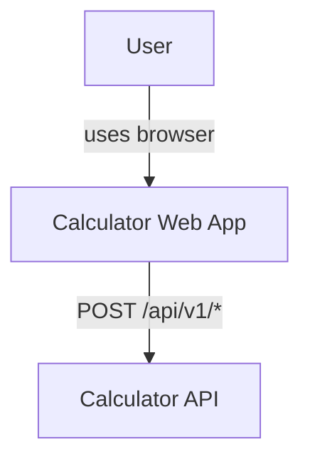

# C4 Level 1 — System Context

```mermaid
flowchart TB
  user[User]
  app[Calculator Web App]
  api[Calculator API]

  user -->|"uses browser"| app
  app -->|"POST /api/v1/*"| api
```

The user interacts with the Calculator Web App to perform arithmetic operations. The web app delegates all calculations to the Calculator REST API.
