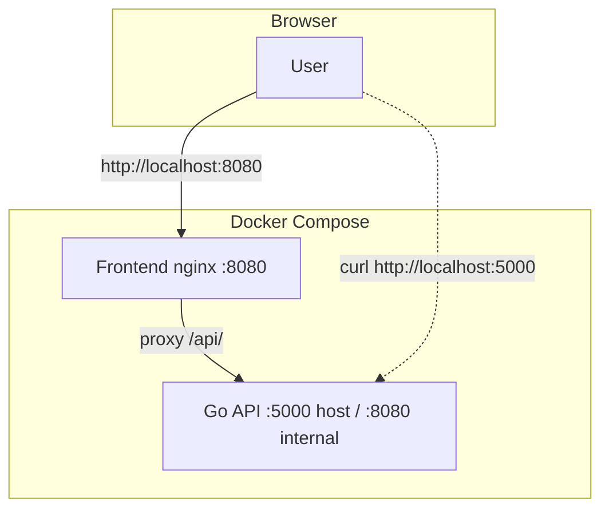

# C4 Level 2 — Containers

| Container | Technology | Port (host) |
|-----------|------------|-------------|
| Frontend | React SPA + nginx | 8080 |
| Backend | Go REST API | 5000 (direct), 8080 (internal) |

Local dev (no Docker): Vite on :5173 → Go on :8080.
