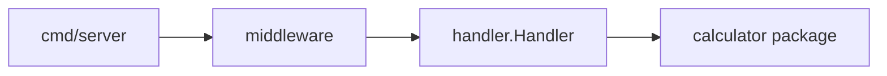

# C4 Level 3 — Backend Components

| Component | Responsibility |
|-----------|----------------|
| `cmd/server` | Route wiring, server startup |
| `middleware` | CORS (local dev), slog request logging |
| `handler` | JSON decode/encode, HTTP status mapping |
| `calculator` | Pure arithmetic, sentinel domain errors |

Domain layer has no HTTP dependencies.
