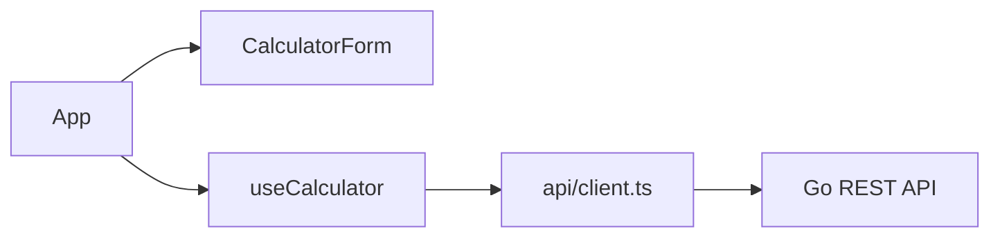

# C4 Level 3 — Frontend Components

| Component | Responsibility |
|-----------|----------------|
| `CalculatorForm` | Presentational UI — inputs, operation select, result/error |
| `useCalculator` | Form state, validation, submit orchestration |
| `api/client.ts` | Typed fetch wrapper, one function per operation |
| `api/errors.ts` | `ApiError` class for structured error handling |

Components do not call `fetch` directly.
